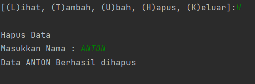

# pratikum8

Nama : Chaerul Hidayat

NIM : 312210300

Kelas : TI.22.A3    

1. Pertama kita mendeklarasikan sebuah class mahasiswa yang didalamnya terdapat atribut NIM, Nama, nilai tugas, nilai UTS dan nilai UAS. Jangan lupa, untuk mendeklarasikan sebuah class didalam OOP kita harus menggunakan def__init__ dan juga self. 
    
2. Seperti biasa, deklarasikan satu dictionary kosong sebagai tempat menyimpan data-data yang sudah kita input. Ada 5 list kosong yang nantinya berisi NIM, Nama, nilai tugas, nilai UTS dan nilai UAS. 
  
3. Kita akan buat beberapa method untuk menambahkan, menampilkan, menghapus, mengubah data mahasiswa. Pertama membuat method tambah(), method ini berfungsi untuk menambahkan data. Dalam method ini kita menggunakan append() supaya data yang terakhir ditambahkan ada di urutan list paling akhir. 
  
dan ini tampilan output jika kita menginput [(Tambah)]() 
  
5. dan ini tampilan output jika kita menginput [(Lihat)]() 
 
  
6. dan ini tampilan output jika kita menginput [(Ubah)]() 
 
 
dan ini adalah hasil data yang di ubah  
  

7. dan ini tampilan output jika kita menginput [(Hapus)]() 
 
  
dan ini adalah tampilan jika data di hapus  
  

Dan ini adalah diagram class 
  

Dan ini flowchart nya  
  

_TERIMA KASIH_